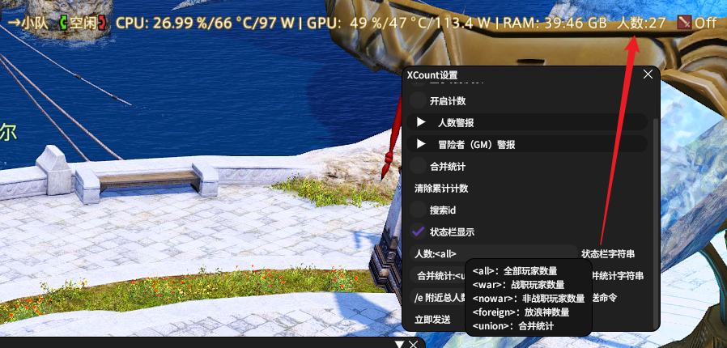

# XCount

## 基本功能：人数统计

统计周围玩家总数量，战职/非战职/跨服玩家数量，搜索特定id的玩家  
```
/xc 打开主界面
/xcset 打开设置界面
/xclist 打开周边玩家列表

...还有一些命令详见插件安装界面
```

## UI功能：状态栏显示人数



## 查找“冒险者”（技术预览版，有bug请反馈喵，谢谢喵）

增加冒险者警报，检测到周围存在“冒险者”职业的玩家时，可以在其身下画一个圈圈，也可以把警报发到聊天栏，可以在设置里的“冒险者警报”一栏进行相关设置。  

正常的玩家不会拥有这个职业，可能可以用来判断GM。已经经过验证的是，开启了隐身功能的“玩家”，仍会出现在卫月的ObjectTable中，原理上，检测隐身的“玩家”是有可能的。

感谢群友胡萝卜布丁的帮助，找到了一种查找隐身GM的可能方式。不过客观来说，这一项的结果永远都是推测，因为不可能真的进行完整且确定的测试。

## 其他

建议结合qol bar使用本插件  
qolbar预设示例：
``H4sIAAAAAAAACuVVvUrDUBh9FflwM41pGtvmbjYoFopVIyhKkfQ2aULTpCSpVEpBB8FNHMTZTZfiKAV9GvvjW/jdpIklXZztcMn5fs65554lfVgPrjo6EDh0KyXN48vtjusFltPc2OkxVHYMl1uLhsBBPQvE6do2IhFIP83GoxjNhX0HZ6eK23UCLFpABA78CpDzJaZqLhO/RqPJ4xsWQUik2Nrs0USodQDE0GxfjzQjW+1o1QYiibIk5wuivMXq7bBvnQHJ8gxU0YSACE8NyyMcsz5tRIu0oUbfEyRIDKjV5DaqYJO1OihS5CQUoOpcmO7GYL/0S9hbgEqCLyy8Y8D9KYvJ++30dZTOgtp6uLGCgYzvH76vb5YCMbVgNfOYDT+nH8N0Hr6+onGM755mzy/pOGzL/3d51Dgwk1YDiMiBFupfhtjEAObDOppBZUwuFjtOILMi8LliQZJlOc9lBF5GYYwhXnVDNX/uzsNnhsCIjftMQQof46DzwOsyFpBMdoDD5Lfh428jQhS1IoRGQeRzvMgLMPgBkRbGiJIGAAA=``  

仓库地址：``https://raw.githubusercontent.com/uiharuayako/DalamudPlugins/main/pluginmaster.json``  
添加仓库以获取更新